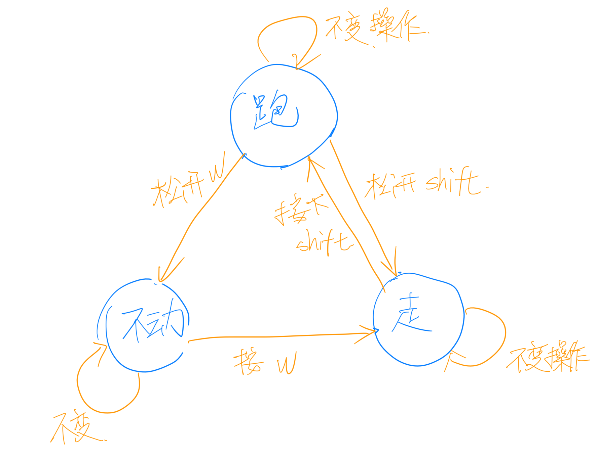
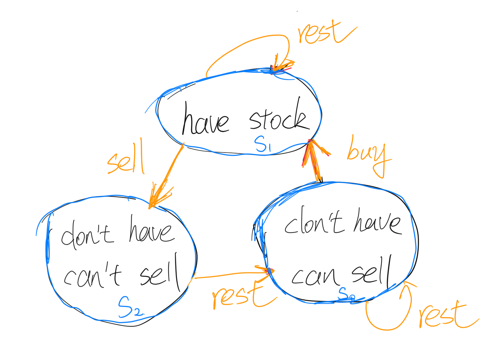
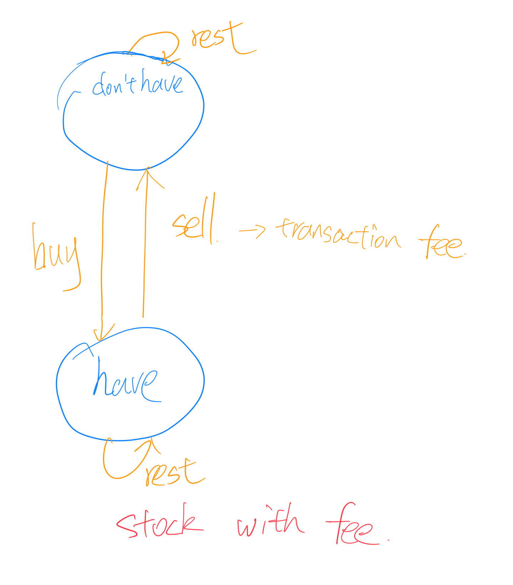
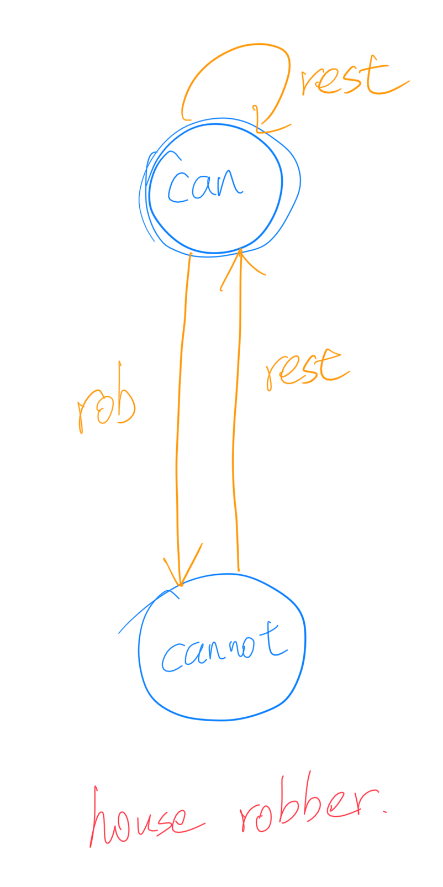
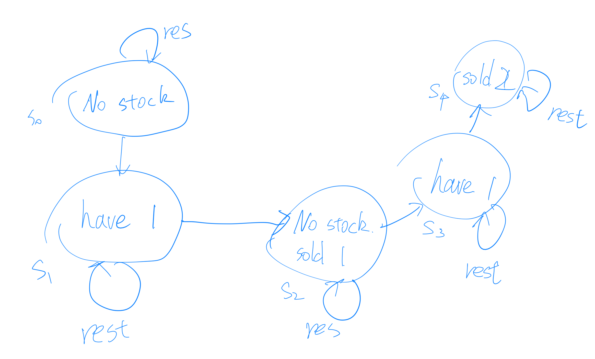

好久不见。

其实主页菌最近一直有在大量刷题，平均一天3.75道...只不过实在是没有时间再每天这么详细地总结了... ...所以只总结一下经典的题目。

今天来利用Best time to buy and sell stock这道题来总结一下一个新的做题套路：State Machine，状态机。

最基本的题：

#### 121. Best Time to Buy and Sell Stock

> Say you have an array for which the ith element is the price of a given stock on day i.
> 
> If you were only permitted to complete at most one transaction (i.e., buy one and sell one share of the stock), design an algorithm to find the maximum profit.
> 
> Note that you cannot sell a stock before you buy one.
> 
> **Example 1:**
> 
> ```
> Input: [7,1,5,3,6,4]
> Output: 5
> Explanation: Buy on day 2 (price = 1) and sell on day 5 (price = 6), profit = 6-1 = 5.
>              Not 7-1 = 6, as selling price needs to be larger than buying price.
> ```
> 
> **Example 2:**
> 
> ```
> Input: [7,6,4,3,1]
> Output: 0
> Explanation: In this case, no transaction is done, i.e. max profit = 0.
> ```


大概意思是说给一个数组，每个数代表当天的股票价格，问buysell一次获得的最大收益是多少。必须先buy再sell。

简单解法。

```
class Solution {
    public int maxProfit(int[] prices) {
        // corner case
        if (prices.length == 0) return 0;
        int minVal = prices[0], globalMax = 0;
        for (int i = 1; i < prices.length; ++i) {
            int price = prices[i];
            if (price - minVal > globalMax) {
                globalMax = price - minVal;
            }
            minVal = Math.min(price, minVal);
            
        }
        return globalMax;
    }
}
```
思路是，记录一个全局收益最大值和一个全局股票价格最小值。每遍历到一天，先和当前见到过的股票的最小值作差(得出当前可能获得的最大收益)，再更新当前见过的股票最小值。挺合理的。

升级一下，假设我们可以buysell无数次，但是每次只能持有一只股票。这样就变成了**122. Best Time to Buy and Sell Stock II**这道题。

```
class Solution {
    public int maxProfit(int[] nums) {
        // corner case
        if (nums == null || nums.length == 0 || nums.length == 1) {
            return 0;
        }
        int sum = 0;
        for (int i = 1; i < nums.length; ++i) {
            if (nums[i] - nums[i - 1] > 0) {
                sum += nums[i] - nums[i - 1];
            }
        }
        return sum;
    }
}
```

思路也比较简单，只要前后两天有差价可赚，我们就buysell一次，来保证获得所有收益。

再扩展：假设我们加上buysell冷却限制，如果这一天sell了股票，那么接下来的一天不可以buy股票。相当于有一天的“冷却时间”。这样就变成了**309. Best Time to Buy and Sell Stock with Cooldown**这道题。

主页菌一开始的思路是，既然可以无限次交易，那么我们还是应该尽量吃全所有的收益，所以还是应该计算每个相邻的两天的股票差价。比如：

```
[1, 2, 3, 0, 2] -> [1, 1, -3, 2]
```
有一天的冷却，所以相邻两天的收益不能同时获得。这个思路和house rob很像，于是主页菌就想用house rob的方法来针对处理后的数组来计算。但是这是不对的，因为我们不一定要前一天buy了后一天就sell，我们可以持有这只股票保持一段时间，这样`[1, 2, 3]`的价格我们可以吃满2的收益，而不会因为冷却的原因只能获得1的收益。

因为冷却时间的缘故，我们需要知道后面股票的信息才能做出当天的决策。所以其实我们用这种“高频交易”思路是不可能做出来的，

其实这道题还有更多的变种，比如：每一笔交易要交固定的手续费(714)、最多执行k次buysell操作(188)。有没有一种通用的方式来解决这类问题呢？

有，用**State Machine/状态机**的思想。

主页菌第一次接触状态机这个词还是在学Unity的时候。

大意是说，针对某一个对象，定义这个对象的一些状态；此对象在一些条件/限制下可以在不同状体之间转换，如图1。



圈代表状态，线代表转换关系。冷却时间股票这个题可以画成下面这个图.



有了前一个状态，我们可以推断出后一个状态。如果我们构建三个数组，s0, s1, s2，s0[n]代表第n天的时候，处于s0状态时最大资金持有量(s1, s2)同理。求s0[i]时我们只要知道s0[i-1], s1[i-1], s2[i-1]就行(可能也并不需要知道全)。

**如何对待buysell这两种操作？** 
 buy/sell是状态机状态转换的两种条件/操作，还有第三种"rest"。

```
buy -> 资金量减小
sell -> 资金量增加
rest -> 资金量不变
必须先buy后sell -> sell操作不能在don't have状态下发生
```

对于“收益”，naive的想法是计算buy/sell的差值，但是这样的认知反其实阻碍我们的思考。从状态机这个模型中我们可以认识到：任何状态和任何转换关系在地位上都是等同的。

假设i天的股票价格为price，则用代码来表示各种状态间的转换关系为：

```
s0[i] = max(s0[i - 1], s2[i - 1])
s1[i] = max(s0[i - 1] - price, s1[i - 1])
s2[i] = max(s1[i - 1] + price, s2[i - 1])
```

**参考答案**

```
class Solution {
    public int maxProfit(int[] prices) {
        // corner case
        if (prices == null || prices.length == 0) {
            return 0;
        }
        // 初始化三个状态, s1是买之后的，所以开始是负数
        int s0 = 0, s1 = -prices[0], s2 = 0;
            
        for (int i = 1; i < prices.length; ++i) {
            int price = prices[i];
            int t0 = Math.max(s0, s2);
            int t1 = Math.max(s0 - price, s1);
            int t2 = Math.max(s1 + price, s2);
            
            s0 = t0;
            s1 = t1;
            s2 = t2;
        }
        
        return Math.max(s2, s0);
    }   
}
```

稍微总结一下何时使用状态机模型：

- 状态多。比如cool down这道题
- 状态转换复杂。
- 尾部拼接，即严格地从上一个推断到下一个(可能不严格也可以，比如两个，有点类似于ML某个模型，遇到了再说)

主页菌还在其他一些题上进行了一些验证。


#### 714. Best Time to Buy and Sell Stock with Transaction Fee



```
class Solution {
    public int maxProfit(int[] prices, int fee) {
        // corner case
        if (prices == null || prices.length == 0) {
            return 0;
        }
        int s0 = 0, s1 = -prices[0];
        for (int i = 1; i < prices.length; ++i) {
            int price = prices[i];
            int t0 = Math.max(s0, s1 + price - fee);
            int t1 = Math.max(s0 - price, s1);
            s0 = t0;
            s1 = t1;
        }
        return Math.max(s0, s1);
    }
}
```

#### 198. House Robber



```
class Solution {
    public int rob(int[] nums) {
        // corner case
        if (nums == null || nums.length == 0) {
            return 0;
        }
        int s0 = 0, s1 = nums[0];
        for (int i = 1; i < nums.length; ++i) {
            int t0 = Math.max(s0, s1);
            int t1 = s0 + nums[i];
            
            s0 = t0;
            s1 = t1;
        }
        
        return Math.max(s0, s1);
    }
}
```

#### 123. Best Time to Buy and Sell Stock III



```
class Solution {
    public int maxProfit(int[] nums) {
        // corne case
        if (nums == null || nums.length == 0) {
            return 0;
        }
        int s0 = 0, s1 = - nums[0], s2 = 0, s3 = - nums[0], s4 = 0;
        for (int i = 1; i < nums.length; ++i) {
            int p = nums[i];
            int t0 = s0;
            int t1 = Math.max(0 - p, s1);
            int t2 = Math.max(s1 + p, s2);
            int t3 = Math.max(s2 - p, s3);
            int t4 = Math.max(s3 + p, s4);
            
            s0 = t0;
            s1 = t1;
            s2 = t2;
            s3 = t3;
            s4 = t4;
        }
        return s4;
    }
}
```